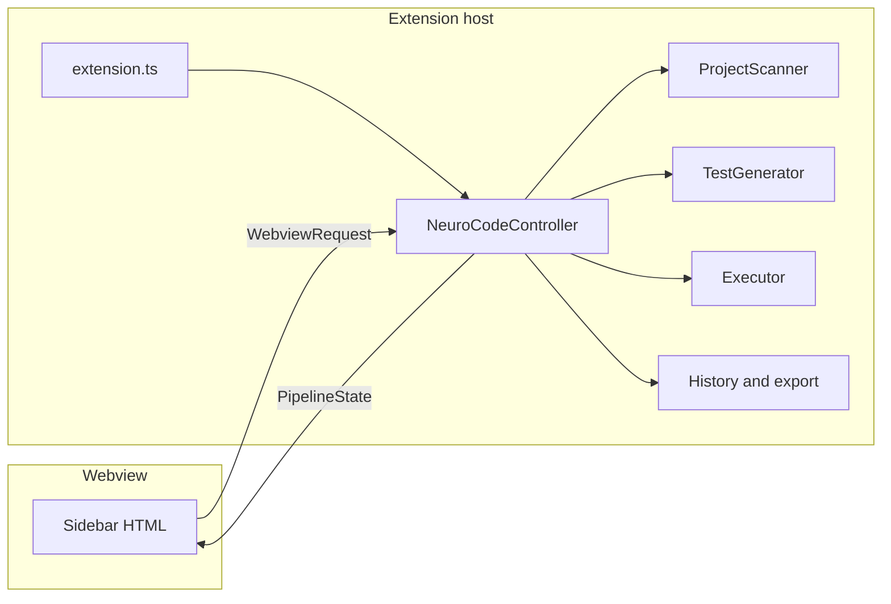
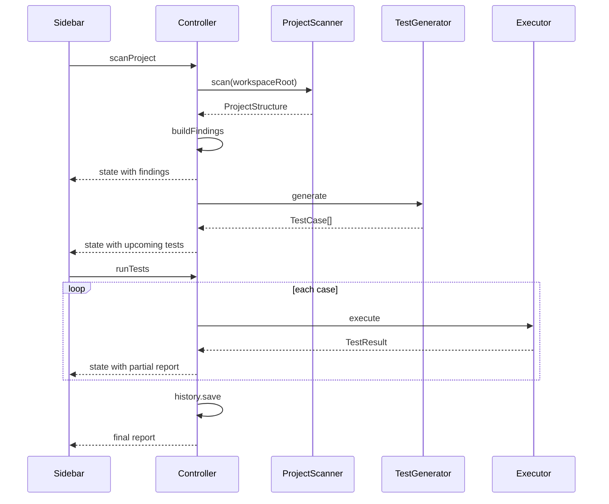

# NeuroCode Software Quality Analyzer

NeuroCode is a Visual Studio Code extension that tests the project you have open, without leaving the editor.

It scans the codebase, builds a test plan from the pages, forms, API endpoints, and commands it actually finds, runs those cases, and shows pass or fail in the sidebar with the evidence for each one. With an API key it asks a language model to write the plan. With no key it builds the plan itself from the scan, so the pipeline still runs offline.

It is aimed at student teams, junior developers, freelancers, and small software houses who usually check the happy path and miss invalid input, boundary values, and regressions.

## What problem it solves

Most small teams confirm that a feature works, then move on. Invalid input, missing fields, unknown routes, and bugs introduced by a later change are left for users to find. Existing tools split that work apart:

| Tool kind | What it does | What it does not do |
| --- | --- | --- |
| Playwright, Cypress, Selenium | Run browser scripts you write and maintain | Invent the scenarios from your project |
| SonarQube, CodeQL, Codacy | Analyze source code for quality and security | Exercise a running app or API |
| Copilot and similar assistants | Generate a test function when you ask | Scan the open project, run the suite, and report results in one place |

NeuroCode keeps scan, plan, run, and report in one sidebar.

## How a run works

1. **Scan.** NeuroCode reads the open folder and classifies it as a web app, REST API, Electron app, CLI, Node backend, or unknown. It then walks the tree for pages, form fields, HTTP endpoints, request schemas, CLI commands, npm scripts, and source files. The sidebar lists what it found.
2. **Plan.** From that inventory it writes test cases. Each case has an id, a category, a priority, a plain-language description of what it checks, action and assertion steps, and a machine-readable spec the runner can execute. Nothing is invented that the scan did not see.
3. **Test.** The matching engine runs each case. Results appear on the same cards: status, duration, and the response, log, or screenshot.
4. **Report.** You can rerun the failures and export the run as Markdown or JSON. The last 20 reports are kept locally.

**Scan** does steps 1 and 2. **Test** does step 3. You can also generate a plan on its own from the command palette after a scan.

## What it looks for

The scan always looks at every surface, not only the detected type.

- **Pages.** React Router paths, Next.js `app/` and `pages/` files.
- **Forms.** `input`, `select`, and `textarea` fields, including whether they are required.
- **API endpoints.** Express-style `app.get('/path')` registrations, Nest-style `@Get('/path')` decorators, and `.route('/path')`. Matching TypeScript interfaces and Zod objects are used as request schemas when the name lines up with the path.
- **Commands.** Commander and Yargs registrations, plus `package.json` `bin` entries.
- **Files and scripts.** A sample of source files and the npm scripts, so the sidebar still shows what was read when a project has little structure.

Comments, `node_modules`, build output, and the local test fixture are skipped so example strings in the extension itself are not treated as real endpoints.

## Test cases

Every case belongs to one of four categories from the project scope:

| Category | What it checks | How a pass is decided |
| --- | --- | --- |
| Positive | The main success path | HTTP success is a 2xx |
| Negative | Invalid input or an unknown path | The server must reject it with a 4xx. A 200 is a failure |
| Boundary | An odd but non-crashing input, such as an unknown query parameter or a very long field | Any status below 500 |
| Regression | The same critical success path, checked again | Same rule as positive |

A **500 is a failure in every category.**

Each case also has steps, in the same spirit as a reviewable test plan:

- **action** — what the runner will do (`Send POST /login with body ...`, `Open /login`, `Run my-cli`)
- **assertion** — the expected outcome

HTTP and browser cases call `neurocode.appUrl`, which defaults to `http://localhost:3000`. Start the app under test before you press **Test**, or point that setting at the real port.

## Engines

| Engine | Used for | Evidence on failure |
| --- | --- | --- |
| HTTP (`fetch`) | REST endpoints | Status, expected-versus-actual diff, response body |
| Playwright (Chromium) | Web pages and forms | Error text and a screenshot |
| Process (`child_process`) | CLI commands | Exit code and captured stdout/stderr |

Browser tests resolve relative paths such as `/login` against `neurocode.appUrl`. Playwright runs headless unless `neurocode.playwrightHeadless` is turned off.

## Sidebar

Open the **NeuroCode** icon in the activity bar. The **QA Pipeline** view has four actions:

- **Scan** — inventory the project and build the upcoming test list
- **Test** — run that list
- **Rerun failed** — run only the cases that failed or errored
- **Export** — save a Markdown or JSON report

Each upcoming card shows the case id, category, priority, what it tests, and the steps. After a run, the same card shows PASS, FAIL, or ERROR, the message, and the evidence.

## Architecture

NeuroCode is one VS Code extension. There is no separate backend service. The extension host does the work. The sidebar is only a view of that work.

Two processes are involved, because that is how VS Code webviews work:

| Process | Code | Allowed to do |
| --- | --- | --- |
| Extension host | everything under `src/` except the panel HTML string | Read the workspace, call the model, run HTTP / Playwright / processes, write reports |
| Webview | the HTML and script inside `src/panel/neurocodePanel.ts` | Render `PipelineState` and send button clicks back |

The webview cannot import `src/` modules and cannot touch the filesystem. If a feature needs data, the host puts it on `PipelineState` and posts that object. If a feature needs an action, the webview posts a `WebviewRequest`.



### Pipeline the controller owns

`NeuroCodeController` in `src/extension/controller.ts` is the only owner of pipeline state. `activate()` in `src/extension/extension.ts` constructs it with the first workspace folder and calls `register()`.

`register()` does two things:

- `vscode.window.registerWebviewViewProvider('neurocodeDashboard', panel)` so the activity-bar view is a webview, not a tree
- registers the six commands: scan, generate, run, rerun failed, show dashboard, export

`PipelineState` lives on the controller. The panel asks for it with `getState` and receives a fresh copy after every change. Flags on that object (`scanning`, `generating`, `running`) are what disable the buttons.

A **Scan** click is `scanProject`, which then calls `generateTests` itself:



`generateTests` can still be called on its own from the command palette. It refuses to run until `scanProject` has stored a `ProjectStructure`.

### Modules

```
src/extension/extension.ts          activate / deactivate. Picks the workspace root.
src/extension/controller.ts         State, commands, message switch, scan then plan then run.
src/panel/neurocodePanel.ts         WebviewViewProvider. Renders HTML. No business logic.
src/shared/types.ts                 The contract: structure, plan, specs, results, messages.

src/scanner/detector.ts             Project type from package.json or Python manifests.
src/scanner/scanner.ts              ProjectScanner. Runs every scanner, then lists files.
src/scanner/webScanner.ts           Routes, Next/pages files, forms, interactive components.
src/scanner/apiScanner.ts           Express and decorator routes, interfaces, Zod objects.
src/scanner/cliScanner.ts           Commander, Yargs, package.json bin.
src/scanner/ignore.ts               Folders and comment lines every scanner skips.
src/scanner/findings.ts             ProjectStructure to the sidebar rows.

src/generator/testGenerator.ts      Chooses offline planner or the language model.
src/generator/mockGenerator.ts      Deterministic cases from the structure.
src/generator/planSteps.ts          Human action/assertion text and URL joining.
src/generator/llmProvider.ts        POST /chat/completions. Returns raw JSON text.

src/executor/executor.ts            Picks a runner from test.engine and builds TestReport.
src/executor/engine.ts              ExecutionEngine and ExecutionContext.
src/executor/httpRunner.ts          fetch plus the pass/fail rules.
src/executor/playwrightRunner.ts    Chromium. Loaded only when a browser case runs.
src/executor/processRunner.ts       spawn, timeout, exit code, stdout/stderr.

src/reporter/report.ts              Markdown and JSON export.
src/reporter/history.ts             Last 20 reports as JSON in extension global storage.
```

`webview/` is an earlier React dashboard. The sidebar does not load it. New UI work goes in `neurocodePanel.ts`. Do not add a second place that owns pipeline state.

`test/fixture` is a two-route Express app used by `npm run test:extension`. It is excluded from scans of this repository by `SCAN_EXCLUDE`, so it does not show up as endpoints of NeuroCode itself. When that folder is the workspace, it is a normal API project.

### Shared types

`src/shared/types.ts` is the schema. Host, runners, and the sidebar all speak these shapes. The sidebar receives them as JSON, so every field must be serializable. No functions, no VS Code `Uri` objects, no class instances.

| Type | Role |
| --- | --- |
| `ProjectType` | `web`, `api`, `electron`, `cli`, `node-backend`, `unknown` |
| `ProjectStructure` | What the scanners returned: manifests, `web`, `api`, `cli`, file sample |
| `ScanFinding` | One sidebar inventory row: `group`, `label`, `detail` |
| `TestCase` | One planned case: id, category, priority, description, steps, engine, spec, expected |
| `PlanStep` | `{ type: 'action' \| 'assertion', description }` |
| `HttpSpec` | method, url, headers, query, body |
| `BrowserSpec` | url plus `BrowserAction[]` |
| `ProcessSpec` | command, args, cwd, stdin, timeout, expectExitCode, expectOutputContains |
| `TestResult` | status, duration, message, `FailureEvidence` |
| `TestReport` | counts plus `results[]` |
| `PipelineState` | everything the sidebar is allowed to draw |
| `WebviewRequest` | sidebar to host |
| `WebviewResponse` | host to sidebar |

Case ids look like `TC001`. Categories are only `positive`, `negative`, `boundary`, and `regression`. Priorities are `high`, `medium`, or `low`. Boundary cases are medium. The others are high.

`engine` chooses the runner. It is not inferred again at run time from the project type. A web project can still contain HTTP cases when the API scanner found routes.

### Messages

The panel script calls `acquireVsCodeApi()` once and `postMessage`s a `WebviewRequest`. The host handles it in `handleMessage`. After the work, it `postMessage`s `{ type: 'state', state }`. The page replaces its local copy and re-renders. There is no other channel.

| Request `type` | Host method | When the sidebar sends it |
| --- | --- | --- |
| `getState` | push the current state | Page load |
| `scanProject` | `scanProject` | Scan |
| `generateTests` | `generateTests` | Command palette. Scan calls this internally too |
| `runTests` | `runTests(testIds?)` | Test. `testIds` limits the run to those cases |
| `rerunFailed` | `rerunFailed` | Rerun failed |
| `exportReport` | `exportReport` | Export |
| `updateTest` | replace one case in `state.tests` | Reserved for a later edit UI |
| `deleteTest` | drop one case | Reserved for a later edit UI |

Responses the page already understands: `state`, `scanDone`, `testsGenerated`, `runStarted`, `runProgress`, `runDone`, and `error`. The controller currently publishes `state` for all of those transitions. Progress during a run is the same `state` message with a growing `report.results` array.

The view contribution in `package.json` must stay `"type": "webview"` with id `neurocodeDashboard`. The provider is registered under that same id. A tree view will mount an empty sidebar even when the provider is correct. Activation is `onStartupFinished` and `onView:neurocodeDashboard`.

The page script is inline and uses a nonce. Buttons use `data-action` and one click listener. Do not use `onclick` attributes. VS Code will not run them reliably.

### Scan

`ProjectScanner.scan` is the only entry.

1. `detectProjectType` reads `package.json`, or `requirements.txt` / `pyproject.toml` if there is no package manifest.
2. Classification order is electron, then CLI (`bin` or the word "cli"), then API framework, then web framework, then `node-backend` if anything was found, otherwise `unknown`. A repo that depends on both React and Express is labeled `web`, because the web dependency is stored first. That label is only the badge. It does not limit the scan.
3. Web, API, and CLI scanners run together, plus a source-file listing capped at 400 paths.
4. `buildFindings` turns the structure into sidebar groups: API endpoints, Pages, Form fields, UI components, Commands, Scripts, Project files. Paths shown in the sidebar are relative to the workspace.

`SCAN_EXCLUDE` in `src/scanner/ignore.ts` drops `node_modules`, `dist`, `out`, `.git`, `coverage`, and `test/fixture`. `isInComment` drops matches that sit on a `//` line or inside an unclosed `/*` block, so sample strings in our own source are not endpoints.

Scanners are regex and file-name rules, not a full language parser. A route written in a style they do not recognize will be missing from the plan. That is a scanner gap, not a reason for the planner to invent the route.

### Plan

`TestGenerator.generate` builds a short text context from `ProjectStructure` (endpoints, schemas, routes, forms, commands, scripts, dependencies). Then:

- No `neurocode.apiKey` and no `NEUROCODE_API_KEY`: `MockGenerator`.
- Key present: `LlmProvider` posts to `{apiBaseUrl}/chat/completions` with `temperature: 0.3` and `response_format: json_object`. `parseLlmOutput` keeps only cases whose `spec` matches the engine. Missing steps are filled by `stepsForTest`. A priority outside `high|medium|low` falls back to the category default.
- Empty or unusable model output: `MockGenerator` again.

The offline planner walks real endpoints, pages, forms, and commands. For each HTTP endpoint it emits the four categories, in that order, then the list is cut to `neurocode.maxTestCases` (default 20). A request body is taken from a schema only when the schema name matches the last path segment (`/api/users` can use `User`). Otherwise the body is `{ placeholder: 'valid-value' }` and the description says no schema was found. URLs are `joinUrl(appUrl, path)`.

`planSteps.ts` is the only place that turns a spec into the sentences on the card. Change wording there, not in the panel.

### Run

`Executor.run` walks cases in order. The runner is `test.engine`:

| `engine` | Class | Notes |
| --- | --- | --- |
| `http` | `HttpRunner` | Global `fetch`. Query object is appended to the URL. Body is `JSON.stringify` when present |
| `browser` | `PlaywrightRunner` | `import('playwright-core')` on first use. Relative `goto` URLs resolve against `context.appUrl` |
| `process` | `ProcessRunner` | `spawn` without a shell. Default timeout 15s. `SIGKILL` on timeout. `cwd` defaults to the workspace |

`ExecutionContext` is `{ workspaceRoot, appUrl, headless, onProgress }`. `onProgress` is `(result, index, total)`. The controller uses it to push a partial report so the cards update before the suite finishes.

HTTP verdicts live in `judgeHttp`:

- status `>= 500` fails every category
- `negative`, or an expected result that asks for 400/401/403/404/422/reject, passes only on 4xx
- `boundary` passes on anything below 500
- `positive` and `regression` pass only on 2xx

Browser and process cases pass when every action completes, or when the exit code and expected output match. A thrown error becomes status `error` with `durationMs: 0` at the dispatcher, or `failed` inside the Playwright runner when an action throws after launch.

After the loop, the controller stamps `projectName` and `projectType` onto the report and `HistoryStore.save`s it. Files are `{globalStorage}/history/{project}.json`, sanitized, last 20 runs.

### Where to change things

| Task | Touch |
| --- | --- |
| Recognize another framework | `detector.ts` lists, then confirm the right scanner already extracts its routes |
| Recognize another route or form style | the scanner for that surface, and skip comments with `isInComment` |
| New inventory group on the sidebar | `ScanFinding.group` in `findings.ts`, and the group order in the panel script |
| New case shape or field | `types.ts`, then the planner, then the card renderer |
| Different step wording | `planSteps.ts` |
| New runner | implement `ExecutionEngine`, add the kind to `EngineKind`, branch in `Executor.run` |
| New button | `data-action` in the panel, a `WebviewRequest` variant, and a `handleMessage` case that calls the controller |
| Pass/fail rule for HTTP | `judgeHttp` only |

Keep business rules out of the HTML. The panel may format strings. It may not decide whether a case passed.

TypeScript is compiled with `noUnusedLocals` and `noUnusedParameters`. An unused parameter starts with `_`. `npm run compile` emits `src/**` to `dist/` with the same layout. `package.json` `"main"` is `./dist/extension/extension.js`. F5 runs that compile first. The host does not execute TypeScript directly.

## Requirements

- VS Code 1.90 or newer (Cursor and VS Code both work)
- Node.js 18 or newer
- For browser tests only: a Chromium build for Playwright

```bash
npx playwright install chromium
```

HTTP and CLI tests do not need a browser.

## Run it from source

```bash
git clone https://github.com/Code-fever1/NeuroCode.git
cd NeuroCode
npm install
npm run compile
```

In VS Code or Cursor:

1. Open the NeuroCode folder.
2. Run and Debug → **Run NeuroCode Extension** (or press F5).
3. A second window opens with the extension loaded. Open the project you want to test in that window, or use the folder that F5 already opened.
4. Click the NeuroCode icon, then **Scan**, then **Test**.

Command palette equivalents:

- `NeuroCode: Scan Project`
- `NeuroCode: Generate Test Cases`
- `NeuroCode: Run Tests`
- `NeuroCode: Rerun Failed Tests`
- `NeuroCode: Show QA Dashboard`
- `NeuroCode: Export Report`

`npm run compile` is what F5 runs. `npm run dev` also bundles the older React dashboard; the sidebar you see does not depend on that bundle.

## Settings

Open Settings and search for **NeuroCode**.

| Setting | Default | Purpose |
| --- | --- | --- |
| `neurocode.appUrl` | `http://localhost:3000` | Base URL for HTTP and browser cases |
| `neurocode.apiKey` | empty | Language-model key. Empty uses `NEUROCODE_API_KEY`, then the offline planner |
| `neurocode.apiBaseUrl` | `https://api.openai.com/v1` | Any OpenAI-compatible endpoint |
| `neurocode.model` | `gpt-4o-mini` | Model id sent to that endpoint |
| `neurocode.maxTestCases` | `20` | Cap on cases per plan (1–100) |
| `neurocode.playwrightHeadless` | `true` | Hide the browser window |

The offline planner is deterministic. It builds positive, negative, boundary, and regression cases directly from the scan, and it only attaches a request body schema when the schema name matches the endpoint. If no schema matches, the body is an obvious placeholder and the case says so.

When a key is set, the model is asked for the same JSON shape and is told not to invent routes or fields. If the reply is empty or unusable, NeuroCode falls back to the offline planner.

## Reports and history

Export writes one file you choose:

- Markdown, with the summary, what each case tested, its steps, and a short failure diff
- JSON, with the report and the full test plan

History is a JSON file in the extension's global storage, capped at 20 reports per project. It is not a database server.

File-by-file ownership, the message protocol, and the type contract are in [Architecture](#architecture).

## Scripts

| Command | What it does |
| --- | --- |
| `npm run compile` | Typecheck and compile the extension |
| `npm run watch` | Recompile the extension on save |
| `npm run dev` | Bundle the React dashboard and compile the extension |
| `npm run package` | Build and produce a `.vsix` |
| `npm run test:extension` | Launch VS Code, scan `test/fixture`, generate a plan, and run it |

The fixture is a two-route Express sample (`GET /health`, `POST /login`). The smoke test expects the unknown-path case to fail when that server answers 200 for every GET. That failure is the correct verdict.

## Scope today

This version is the IDE pipeline for a final-year project: detect the project, plan four kinds of cases, run them, and show evidence in the sidebar.

Already in the extension:

- Activity-bar sidebar, command palette, and export
- Whole-project scan of pages, forms, endpoints, schemas, and commands
- Offline plan plus an OpenAI-compatible planner
- HTTP, Playwright, and process execution
- Pass/fail rules that do not treat a 200 as a successful rejection
- Local report history

Not in this version yet:

- Editing a generated case in the sidebar before it runs
- A regression plan based on the git diff, rather than a replay of the main success path
- GraphQL as its own runner (HTTP cases can still call a GraphQL URL)
- A hosted API, PostgreSQL, or a cloud test grid
- Measured pilot results on a production web app and a production API

## License

MIT.
